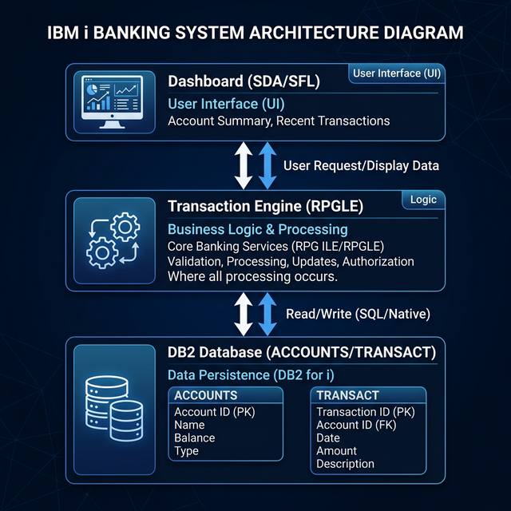

# Multi-Tiered Banking Transaction System (IBM i)



## Project Overview
This project is a robust financial transaction processing engine developed on the IBM i (AS/400) platform. It manages account-level financial operations including deposits and withdrawals while ensuring high data integrity and a responsive user interface via green-screen subfiles.

## Thought Process and Design Choices
The architecture of this system was designed to address three core challenges in enterprise financial systems: Data Integrity, Scalability, and User Efficiency.

1. **Concurrency and Data Integrity (Record Locking)**: In a banking environment, multiple transactions might target the same account simultaneously. Using RPGLE's native record-level locking (via the `UPDATE` usage on the physical file), the system ensures that a record is locked the moment it is retrieved for a transaction until the update is committed. This prevents "lost updates" where one transaction overwrites another.
2. **User Experience (Subfiles)**: To handle large volumes of data efficiently, the system uses Subfiles (SFL/SFLCTL) in the Display File. This allows the user to browse through thousands of accounts with minimal line traffic, which is a hallmark of efficient AS/400 application design.
3. **Layered Architecture**: 
   - **CLLE (Control Layer)**: Handles the environment setup, library lists, and error trapping at the job level.
   - **DDS (Data Layer)**: Defines the physical structure and unique keys to enforce referential integrity at the database level.
   - **RPGLE (Logic Layer)**: Separates business rules (like checking for sufficient funds) from the UI and database calls.

## How It Works
- **Database Layer**: The `ACCOUNTS` file stores the master balance, while the `TRANSACT` file maintains a ledger. This dual-record approach is essential for auditing.
- **Transaction Logic**: The RPGLE engine uses the `CHAIN` operation to fetch account data. If a withdrawal is requested, it subtracts from the balance only after verifying sufficient funds.
- **Real-time Interface**: The dashboard uses an interactive subfile. Users can select accounts using option codes (like 2 for update) which triggers the underlying logic engine.

## Deployment Instructions on IBM i (AS/400)

Follow these steps to deploy and run the system on your AS/400 machine:

### 1. Environment Setup
Create a library and the necessary source physical files to hold the code:
```sql
CRTLIB LIB(BANKINGLIB)
CRTSRCPF FILE(BANKINGLIB/QDDSSRC) RCDLEN(112)
CRTSRCPF FILE(BANKINGLIB/QRPGLESRC) RCDLEN(112)
CRTSRCPF FILE(BANKINGLIB/QCLSRC) RCDLEN(112)
```

### 2. Upload and Copy Source
Upload the files from this repository into the respective members in your new source files. Use FTP, Access Client Solutions (ACS), or VS Code with the IBM i extensions.

### 3. Compilation Order
The objects must be compiled in the following order to resolve dependencies:

1. **Physical Files (Database)**:
   ```sql
   CRTPF FILE(BANKINGLIB/ACCOUNTS) SRCFILE(BANKINGLIB/QDDSSRC)
   CRTPF FILE(BANKINGLIB/TRANSACT) SRCFILE(BANKINGLIB/QDDSSRC)
   ```
2. **Display File (UI)**:
   ```sql
   CRTDSPF FILE(BANKINGLIB/ACCT_DSPF) SRCFILE(BANKINGLIB/QDDSSRC)
   ```
3. **RPGLE Program (Logic)**:
   ```sql
   CRTBNDRPG PGM(BANKINGLIB/TXN_ENGINE) SRCFILE(BANKINGLIB/QRPGLESRC)
   ```
4. **CLLE Program (Driver)**:
   ```sql
   CRTBNDCL PGM(BANKINGLIB/INIT_PGM) SRCFILE(BANKINGLIB/QCLSRC)
   ```

### 4. Running the Application
Call the initial program to set up your library list and start the dashboard:
```sql
CALL PGM(BANKINGLIB/INIT_PGM)
```

---
*Developed as part of the IBM i & Data Projects Portfolio.*
